# Data Model

Entity-relationship diagram derived from the migrations in
[`src/knex/migrations/`](../src/knex/migrations/).

## Notes

- **`token` on `users`** is what makes logout a real server-side revocation:
  `context()` rejects a cryptographically-valid JWT if it no longer matches
  the row's `token` column (see [`auth-flow.md`](./auth-flow.md)).
- **`index_ref`** on `users`/`posts` is an app-managed, monotonically
  increasing per-table counter (`MAX(index_ref) + 1`) — separate from the
  auto-increment `id`, used for stable display ordering independent of
  primary-key gaps left by deletes.
- **Cascading deletes are enforced by MySQL itself**, not application code:
  `posts.user_id` and `comments.post_id` / `comments.user_id` all declare
  `.onDelete('CASCADE')`. Deleting a user deletes their posts *and* their
  comments; deleting a post deletes its comments. This is verified against a
  real database in
  [`post-datasource.integration.test.ts`](../src/__tests__/integration/post-datasource.integration.test.ts)
  and
  [`comment-datasource.integration.test.ts`](../src/__tests__/integration/comment-datasource.integration.test.ts).
- **`comments` is the only table with `updated_at`** — it comes from
  `table.timestamps(true, true)` in its migration, while `users` and `posts`
  only declare a single `created_at` timestamp. The app doesn't currently use
  `updated_at` for anything (comments aren't editable), which is a candidate
  for either wiring up or removing.
- The `comments` migration originally shipped with unconstrained integer
  `post_id`/`user_id` columns; the foreign keys were added later in
  `20260310130002_add-fk-to-comments.ts` — a good example of an
  additive, backwards-compatible migration.
