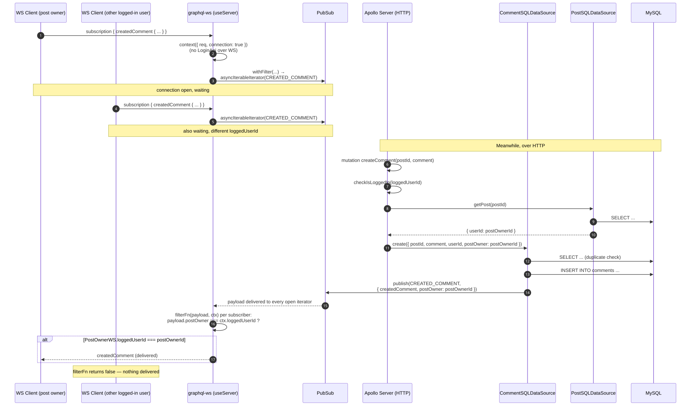

# Real-Time Comments (Subscriptions) Flow

`createdComment` is the one subscription in the schema: it notifies **the
owner of a post** whenever a new comment is created on it — nobody else, not
even the comment's own author.



## Why filtering happens per-subscriber, not at publish time

`pubSub.publish()` broadcasts the same payload to **every** open
`createdComment` iterator, regardless of who's listening. The ownership check
lives entirely in the `filterFn` passed to `withFilter` (see
[`comment/resolvers.ts`](../src/graphql/schema/comment/resolvers.ts)):

```ts
const hasPostOwner = payload?.postOwner !== null && payload?.postOwner !== undefined;
const postOwnerIsLoggedUser = payload?.postOwner === context?.loggedUserId;
```

This means the filtering decision is made **per connected client**, using
*that client's own* `context.loggedUserId` — captured once when the WS
connection's context was built — against the *same* published payload. It's a
clean way to do targeted, per-user delivery without a fan-out of separate
PubSub triggers per user.

## Redis vs. in-memory

In production (`NODE_ENV=production`), `REDIS_URL` is required and
`createPubSub()` returns a `RedisPubSub` — necessary the moment there's more
than one server instance, since an in-memory `EventEmitter`-based `PubSub`
only sees mutations that happen to land on the *same process* as the
WebSocket connection. In development/test, the in-memory fallback avoids
needing a local Redis just to run the app. See
[`pubsub.test.ts`](../src/__tests__/pubsub.test.ts) for both branches,
including the startup failure when production is missing `REDIS_URL`.
